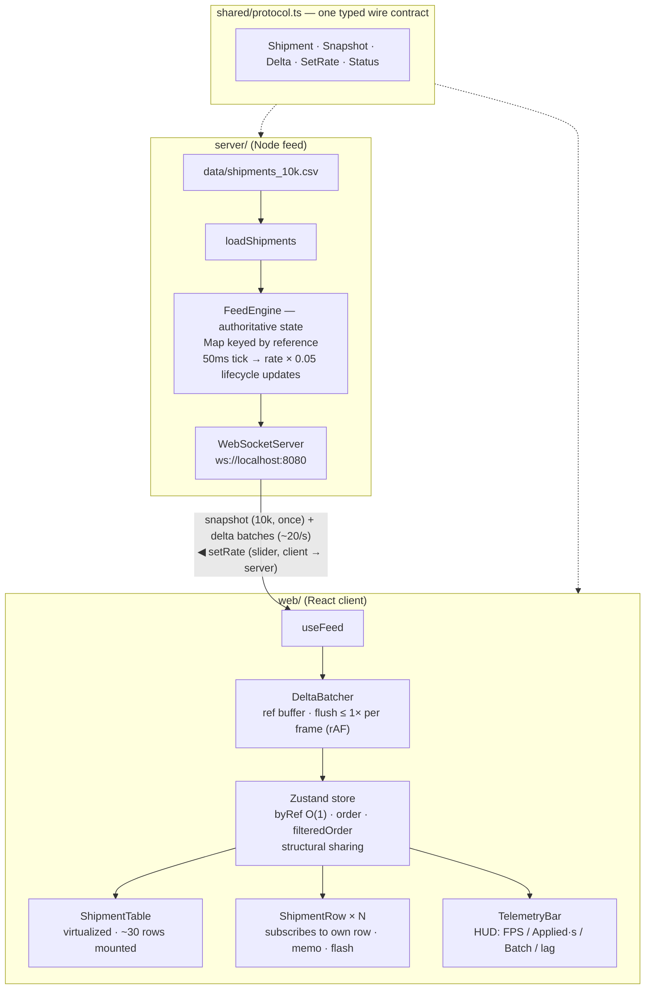
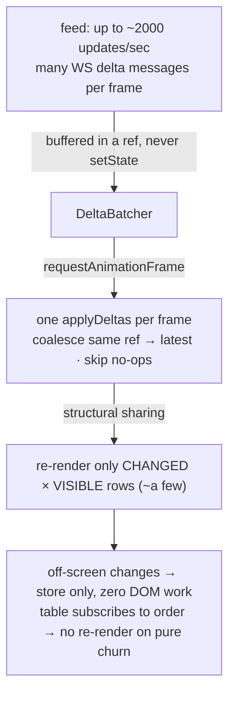

# 架构说明 — Live Ops Board

> 本文为 [`ARCHITECTURE.md`](./ARCHITECTURE.md) 的中文版。图中技术标签保留英文（与代码一致）。

一张高吞吐的货运看板：状态实时涌入时表格依旧流畅。三层结构，边界清晰（也是小团队天然的分工线）：

实测：**1 万行，120Hz 显示器下持续 120fps，同时每秒 800 条状态更新，静止与滚动皆如此**；约 2000 条/秒的数据翻动下筛选依旧正确。

---

## Feed 设计

**feed** 是一条"事件一发生就推送"的变更流（不是静态文件）。它横跨三段：**生产者**（`server/feed.ts` 的 `FeedEngine`）、**传输**（`server/index.ts`，WebSocket）、**消费者**（`web/src/feed/useFeed.ts`）。

- **传输——独立 Node `ws` 服务**（而非浏览器内生成器）：真实的网络边界让批处理、背压、重连都是真的，扩展叙事也更具体。本地进程不算"外部服务"，所以一条命令仍能跑起全部。
- **服务端权威状态。** 客户端连接时拿到服务端*当前*状态的快照；该快照不是 feed——其后的 `delta` 流才是。
- **FEED RATE** = 状态更新条/秒（数据流强度），由 UI 滑杆实时设定（速率的唯一真相源，连接时与变更时都向服务端断言）。
- **批量生成。** 引擎每 50ms 产生 `rate × 0.05` 条更新、合并成**一条**消息（`800/s → 40/tick → 20 条消息/s`），故无论速率多高线上始终约 20 条消息/秒——并采用真实生命周期流转（`created → picked_up → in_transit → delivered/failed → 回收`），使每条更新都是真实变更。

## 状态管理选型

**Zustand**——一个极简的外部 store（底层基于 `useSyncExternalStore`）。相比裸 `useState`/Redux 而选它，是因为更新路径必须活在 React 渲染周期*之外*、且更新必须按行——这两点它都以极小的 API 面做到。它所支撑的性能机制（按行 selector + 结构共享）详见下方性能一节；与自建 store 的取舍见 DECISIONS D2。

## 数据层

- **服务端**：`Map<reference, Shipment>`——唯一权威源，由引擎变更。
- **客户端 store**：`byRef`（O(1)、按行订阅）+ `order`（行索引 → reference）+ 派生的 `filteredOrder`（渲染视图）；每行在加载时预计算一个小写 `searchKey`。
- **协议**（`shared/protocol.ts`）：`snapshot` 之后是 `delta` 批次；客户端 → 服务端的 `setRate`。共享类型杜绝两端漂移。

## 渲染性能预算及如何达成

这里有两件事同时爆炸：**数据量**（1 万行）与**更新频率**（数百/秒，最高约 2000）。朴素渲染即 ~1 万个 DOM 节点*加上*每秒数百次完整 React 提交——任一者单独出现都会掉帧。因此预算是：

> **DOM 工作量只与*可见*内容成正比、而非与数据量成正比；且每帧最多一次 React 提交（~16.7ms；120Hz 下 8.3ms）——无论 feed 速率多高都守住。**

下面每条决策都在消除这两个开销爆炸之一。端到端更新路径：

### 让它快的各项决策

| 决策 | 消除的开销 | 收益 |
|---|---|---|
| **虚拟化**（TanStack Virtual） | 1 万个 DOM 节点 → 首屏慢 + 滚动卡顿 | 仅约 30 个节点挂载；渲染/滚动成本与数据量无关、恒定 |
| **rAF 批处理**（`DeltaBatcher`） | 每秒数百次 `setState` → 数百次提交与完整 reconcile | delta 先进 ref 缓冲，**每帧 ≤1 次** flush；重复 ref 合并取最新；丢弃 no-op 批次 |
| **按行订阅 + 结构共享** | 一次更新重渲染整个 1 万行列表 | 每个可见行订阅 `byRef[ref]`；flush 只替换变更行，未变行保持引用（`Object.is`）→ 跳过重渲染——只有约 30 个已挂载 selector 运行 |
| **列表只订阅 `order`/`filteredOrder`** | 表格因每次数据变化而重渲染 | 这些数组在状态更新时不变 → 列表只在滚动/筛选时重渲染，**纯 churn 下从不重渲染** |
| **`getItemKey` 按 reference** | 筛选重排破坏 `React.memo`、并闪错行 | React 在滚动/重排间把一条货运映射到稳定的行实例 → memo 保持有效、高亮保持正确 |
| **仅在状态筛选激活时重算 `filteredOrder`** | churn 下每帧一次 10k 扫描 | delta 改 `status` 但绝不改 `reference`/`customer`，故搜索与无筛选视图在 churn 下从不重扫 |
| **搜索防抖（150ms）+ 预计算 `searchKey`** | 每次击键一次全 10k 扫描；每行每次扫描一次 `toLowerCase` | 每次停顿只扫一次；在加载时构建一次的小写 key 上做零分配子串匹配 |
| **隔离**（`React.memo` + 原始 props；结果计数独立；250ms HUD；CSS 合成器高亮） | 热路径上的附带重渲染与 JS 驱动动画 | 搜索框/chip 在 churn 下不重渲染；HUD 离帧采样；高亮跑在合成器层并尊重 `prefers-reduced-motion` |

离屏更新只触及 store——零 DOM 开销——因此任一帧的成本由*可见*变更行数决定，与数据量或 feed 速率无关。每次 flush 对 `byRef` 的那一次 O(n) 浅拷贝是亚毫秒级的，换来干净的不可变性（若日后 profiling 有需要，原地变更是兜底方案）。

**结果**（通过 [`tools/`](./tools) 的 CDP 脚本 + 独立注入的 FPS 计测得）：800 更新/秒下静止与滚动均持续 120fps；客户端在 1200–2000/秒仍跟得上、每帧批量稳定（无背压）；约 2000/秒 churn 下筛选，**0** 行违反当前筛选。

## 离线容忍（仅设计，未实现）

看板是只读的，"离线"即 feed 断连。设计：

- **秒级冷启动**：把上次快照缓存进 IndexedDB（带版本、按看板）；加载时先水合，并挂 `stale · reconnecting` 横幅。
- **重连**：指数退避 + 抖动。
- **正确重同步**：每单一个单调 version（或用 `last_update`）让客户端丢弃乱序/重复 delta（后写胜出 LWW）。服务端一个有界的近期 delta 环形缓冲（按序列号）支持 **delta 追赶**——客户端带上"最后已见序列号"，只取缺口、无需全量重传。
- **离线网点**：每个 depot 是一个跑在缓存态上的分区，连通后 reconcile（按 `last_update` LWW）；只有 depot 有写操作时才加写 outbox。

## 扩展（10× 行 · 多看板 · 离线网点）

- **10 万行**：虚拟化已覆盖 DOM；把 `computeFiltered` 移到 Web Worker（或增量索引），快照分块传输，并考虑服务端筛选 + 窗口订阅，只推送视窗/筛选内的行。
- **多看板**：一个按 board 归一化的 store + 用 `SharedWorker` 跨标签/看板共享一条 WebSocket，服务端按 topic 多路复用。这也是真正的 monorepo（共享 `@tv/ui` + `@tv/protocol`）开始回本的地方——见 DECISIONS D4。
- **离线网点**：同上（每 depot 分区、LWW 对账）。

## 测试与团队标准

测试针对真正棘手的纯逻辑——批处理、churn 下筛选、feed 速率/生命周期、CSV 守卫，不做宽泛 UI 快照（DECISIONS D9）。三层 + `shared` 契约构成三条并行工作流；DECISIONS 记录、聚焦的测试、[`tools/`](./tools) 里的 CDP 脚本，是小团队无需繁文缛节即可守住标准的方式。
