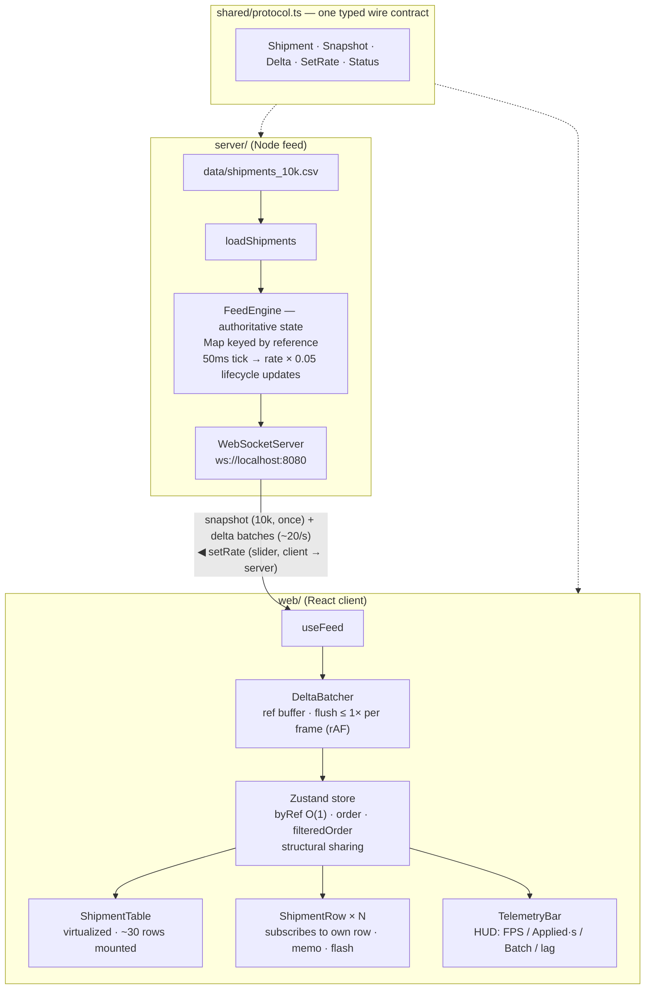
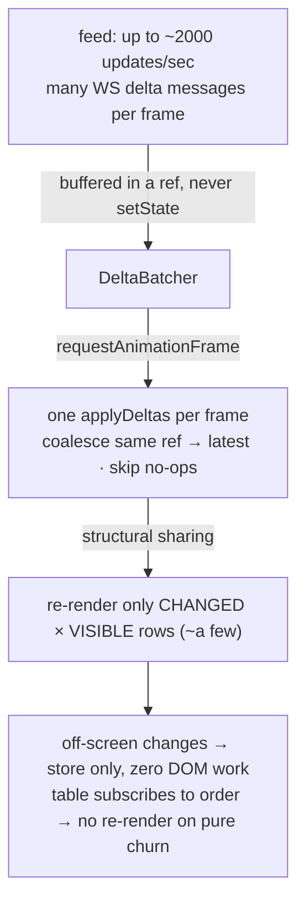

# Architecture — Live Ops Board

A high-volume shipment board that stays smooth while status updates stream in real time. Three
layers, each a clean boundary (and a natural split of work for a small team):

Measured: **10,000 rows at a sustained 120fps (120Hz display) while streaming 800 updates/sec,
idle and during continuous scroll**; correct filtering under churn at ~2000 updates/sec.

---

## Feed design

A *feed* is a stream of change events pushed as they happen (not a static file). It spans a
**producer** (`server/feed.ts` `FeedEngine`), a **transport** (`server/index.ts`, WebSocket), and a
**consumer** (`web/src/feed/useFeed.ts`).

- **Transport — standalone Node `ws` server** (over an in-browser generator): a real network
  boundary makes batching, backpressure, and reconnection real and the scaling story concrete. A
  local process isn't an "external service", so one command still runs everything.
- **Server-authoritative state.** Clients get a snapshot of the server's *current* state on
  connect; that snapshot isn't the feed — the `delta` stream after it is.
- **FEED RATE** = status updates/sec (the stream's intensity), set live from the UI slider (the
  runtime source of truth, asserted to the server on connect and on change).
- **Batched generation.** Every 50ms the engine emits `rate × 0.05` updates as **one** message
  (`800/s → 40/tick → 20 msgs/s`), so the wire carries ~20 messages/sec regardless of rate — with
  realistic lifecycle transitions (`created → picked_up → in_transit → delivered/failed → recycle`)
  so every update is a genuine change.

## State-management choice

**Zustand** — a minimal external store (built on `useSyncExternalStore`). Chosen over bare
`useState`/Redux because the update path must live *outside* React's render cycle and updates must
be per-row, both of which it does with almost no surface. The mechanics it enables (per-row
selectors + structural sharing) are detailed in the performance section below; the trade-off vs. a
hand-rolled store is in DECISIONS D2.

## Data layer

- **Server**: `Map<reference, Shipment>` — the single authoritative source, mutated by the engine.
- **Client store**: `byRef` (O(1), per-row subscription) + `order` (index → reference) + derived
  `filteredOrder` (the rendered view); each row precomputes a lowercase `searchKey` at load.
- **Protocol** (`shared/protocol.ts`): `snapshot` then `delta` batches; client → server `setRate`.
  Shared types keep both sides from drifting.

## Render-performance budget & how we met it

Two things blow up at once here: **dataset size** (10,000 rows) and **update frequency** (hundreds
per second, up to ~2,000). Rendered naively that is ~10k DOM nodes *and* hundreds of full React
commits per second — either alone drops frames. So the budget is:

> **DOM work proportional to what's *visible*, not to the dataset; and at most one React commit per
> frame (~16.7ms; 8.3ms at 120Hz) — held no matter the feed rate.**

Every decision below removes one of those two cost explosions. The end-to-end update path:

### The decisions that make it fast

| Decision | Cost it removes | Payoff |
|---|---|---|
| **Virtualization** (TanStack Virtual) | 10k DOM nodes → slow first paint + scroll jank | only ~30 nodes mounted; render/scroll cost is flat vs. dataset size |
| **rAF batching** (`DeltaBatcher`) | hundreds of `setState`/sec → hundreds of commits + full reconciles | buffer deltas in a ref, flush **≤1×/frame**; coalesce repeated refs to latest; drop no-op batches |
| **Per-row subscription + structural sharing** | one update re-rendering the whole 10k list | each visible row subscribes to `byRef[ref]`; a flush replaces only changed rows, so unchanged rows keep identity (`Object.is`) and skip re-render — only the ~30 mounted selectors run |
| **List subscribes to `order`/`filteredOrder` only** | the table re-rendering on every data change | those arrays don't change on a status update → the list re-renders on scroll/filter, **never on pure churn** |
| **`getItemKey` by reference** | filtered reshuffle breaking `React.memo` and flashing the wrong row | React maps a shipment to a stable row instance across scroll/reshuffle → memo stays effective, highlight stays correct |
| **Recompute `filteredOrder` only when a status filter is active** | a 10k scan every frame under churn | deltas change `status` but never `reference`/`customer`, so search and unfiltered views are never rescanned on churn |
| **Debounced search (150ms) + precomputed `searchKey`** | a full 10k scan per keystroke; a `toLowerCase` per row per scan | one scan per typing pause; allocation-free substring match on a lowercase key built once at load |
| **Isolation** (`React.memo` + primitive props; isolated result count; 250ms HUD; CSS-compositor highlight) | incidental re-renders and JS-driven animation on the hot path | search box/chips don't re-render under churn; the HUD samples off-frame; the flash runs on the compositor and respects `prefers-reduced-motion` |

Off-screen updates touch only the store — zero DOM work — so the cost of any frame is bounded by how
many *visible* rows changed, not by the dataset or the feed rate. The one O(n) shallow copy of
`byRef` per flush is sub-millisecond and buys clean immutability (an in-place mutation is the
fallback if profiling ever demanded it).

**Result** (measured via the CDP harness in [`tools/`](./tools) with an independently-injected FPS
meter): a sustained 120fps at 800 updates/sec both idle and while scrolling; the client keeps up at
1,200–2,000/sec with a stable per-frame batch (no backpressure); filter-under-churn at ~2,000/sec
shows **0** rows violating the active filter.

## Offline tolerance (design only — not implemented)

The board is read-only, so "offline" = the feed disconnects. Design:

- **Instant cold start**: cache the last snapshot in IndexedDB (versioned, per board); hydrate on
  load behind a `stale · reconnecting` banner.
- **Reconnect** with exponential backoff + jitter.
- **Correct resync**: a monotonic per-shipment version (or `last_update`) lets the client drop
  out-of-order/duplicate deltas (last-write-wins). A bounded server-side ring buffer of recent
  deltas keyed by sequence number enables **delta catch-up** — the client sends its last-seen
  sequence and gets only the gap, not a full re-download.
- **Offline depots**: each depot is a partition on cached state that reconciles on reconnect (LWW
  by `last_update`); add a write outbox only if depots gain write actions.

## Scale (10× rows · multiple boards · offline depots)

- **100k rows**: virtualization already covers the DOM; move `computeFiltered` to a Web Worker (or
  incremental indexes), stream the snapshot in chunks, and consider server-side filtering with a
  windowed subscription that streams only rows in view/filter.
- **Multiple boards**: a store keyed by board + a `SharedWorker` sharing one WebSocket across
  tabs/boards, server multiplexing topics. This is where a real monorepo (shared `@tv/ui` +
  `@tv/protocol`) starts to earn its keep — see DECISIONS D4.
- **Offline depots**: as above (per-depot partitions, LWW reconcile).

## Testing & team standards

Tests target the genuinely tricky pure logic — batching, filtering-under-churn, feed rate/lifecycle,
CSV guards — not broad UI snapshots (DECISIONS D9). The three layers + the `shared` contract make
three parallel workstreams; the DECISIONS log, the focused tests, and the CDP harness in
[`tools/`](./tools) are how a small team holds these standards without ceremony.
