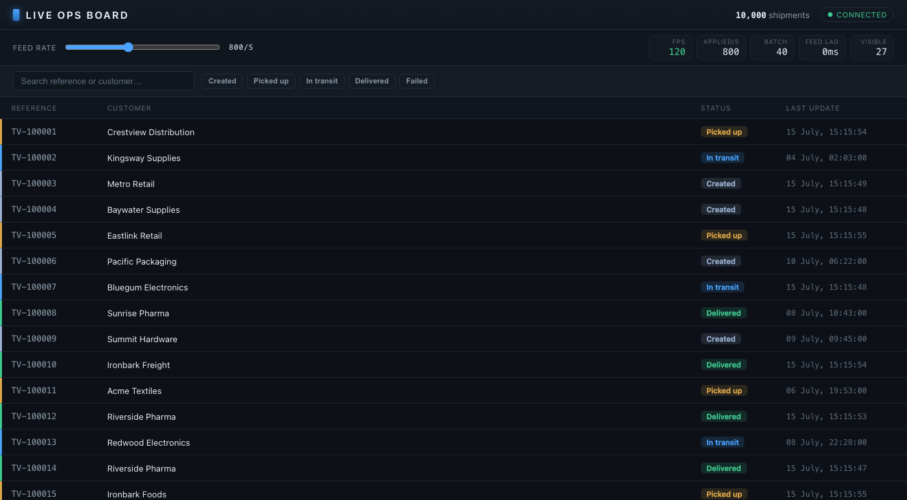

# Live Ops Board

A high-volume shipment operations board: a virtualized table of 10,000 shipments that stays
smooth at **120fps while hundreds of status updates per second** stream in over a self-hosted
WebSocket feed. Built with React + TypeScript, Zustand, TanStack Virtual, and a Node WebSocket
feed — launched with a **single command, no external services**.



## Run the demo

```bash
npm install
npm run dev
```

`npm run dev` starts **both** the feed server (`ws://localhost:8080`) and the web app together via
`concurrently`. Open **http://localhost:5173**.

- Requires **Node 20+** (developed on Node 24). No database, no cloud, nothing else to install.
- Optional: `FEED_RATE=800 npm run dev` sets the feed's initial rate (also adjustable live in the UI).

```bash
npm test        # 26 unit tests (batching, filtering-under-churn, feed engine, CSV)
npm run typecheck
npm run build   # production bundle
```

## Try it

- Drag **FEED RATE** to 2000/s — the table stays smooth; watch the **FPS / Applied/s / Batch** HUD.
- Filter by a **status** chip and type in **search** (reference or customer) while it churns — the
  view stays correct.
- Scroll fast under load — DOM row count stays constant (virtualized).

## Key decisions (and why)

Full trade-offs in [DECISIONS.md](./DECISIONS.md); the performance story is in
[ARCHITECTURE.md](./ARCHITECTURE.md). Headlines:

| Choice | Why |
|---|---|
| **Standalone Node `ws` feed** | An honest, production-shaped feed with a real transport boundary; a local process isn't an "external service", so one command still runs everything. |
| **Zustand + per-row selectors + structural sharing** | A status update re-renders one row, not the list — avoids the "whole-list re-render" trap. |
| **TanStack Virtual** | Constant DOM node count for 10k rows; actively maintained, headless. |
| **rAF batching** | Any arrival rate collapses to ≤1 commit per frame (~16.7ms). |
| **Single package (`web/ server/ shared/`), npm only** | Reproducibility first: only Node needed — one `npm install`, one `npm run dev`, zero extra toolchain. Clear boundaries via folders + a typed `shared` contract. |
| **Tests on the tricky parts only** | Batching, filtering-under-churn, feed engine, CSV guards — not broad UI snapshots (per the brief). |

## Tooling choices

Vite + TypeScript, React 18, Zustand, TanStack Virtual, `ws`, `tsx` (run TS directly),
`concurrently` (one command), Vitest. Chosen for a fast dev loop and minimal setup friction; a
committed `package-lock.json` pins the exact tree (`npm ci` reproduces it).

## What I'd do next

- **Production single-process launch**: serve the built SPA from the feed's Node process so one
  command runs the built app too (today `npm run dev` is the single command).
- **Web Worker for filtering** at 100k+ rows, keeping the main thread free.
- **Delta catch-up on reconnect** (sequence numbers + a server ring buffer) and the IndexedDB
  offline cache described in ARCHITECTURE.md.
- **Playwright smoke test** asserting FPS-under-load and filter-under-churn in CI (the CDP harness
  in [`tools/`](./tools) already proves this locally).
- **Column sorting** and per-status counts in the filter chips.

## AI-usage note

See [AI_USAGE.md](./AI_USAGE.md): tools used, what was AI-generated vs. engineer-directed, and
two concrete things the AI got wrong and how they were caught.

## Project layout

```
web/     React client — virtualized table, Zustand store, rAF-batched updates, filters, perf HUD
server/  Node ws feed — loads the CSV, snapshots, streams randomized status deltas
shared/  wire protocol shared by both sides (Shipment, ServerMessage, status enum)
data/    shipments_10k.csv (bundled — the demo needs no external services)
```
